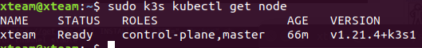
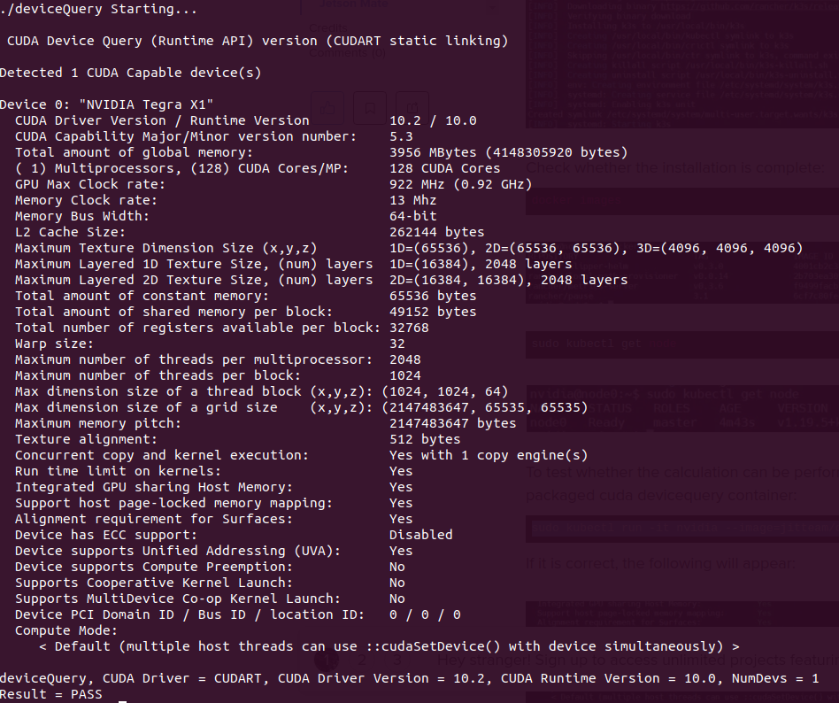
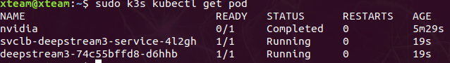
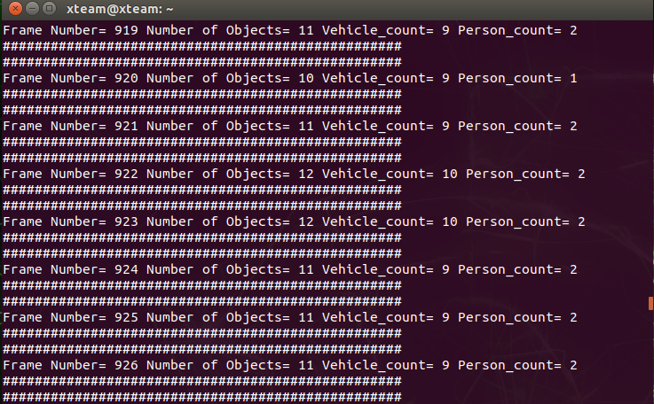
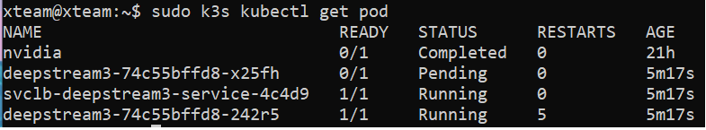

# Overview

- This version is used to deploy a sample deepstream on jetson nano with k3s of kubernete 
- The performance:
    - CPU: 70%
    - RAM: 3.5G/4G

# Install k3s

**1. Build cluster management**

```
curl -sfL https://get.k3s.io | INSTALL_K3S_EXEC="--docker" sh -s -

```
**2. Check whether installation is complete**
```
sudo k3s kubectl get node

```
- The installation complete when the node master's status is ready
- 
- To test whether the calculation can be performed, execute a third-party packaged cuda devicequery container
```
sudo k3s kubectl run -it nvidia --image=jitteam/devicequery --restart=Never

```
- 

# Run deepstream app (python) by k3s on jetson nano

**1. Create a file .yaml to config deepstream**
- Examples: deepstream3.yaml

**2. Deploy to k3s master node**

```
sudo k3s kubectl apply -f deepstream3.yaml

```

- The command window show the results:

- 
- 

**3. Notes**
- When create several replicas in k3s, the node only run one replica (pod).

- If the main pod die, the node will use this replicas to replace.

- 
